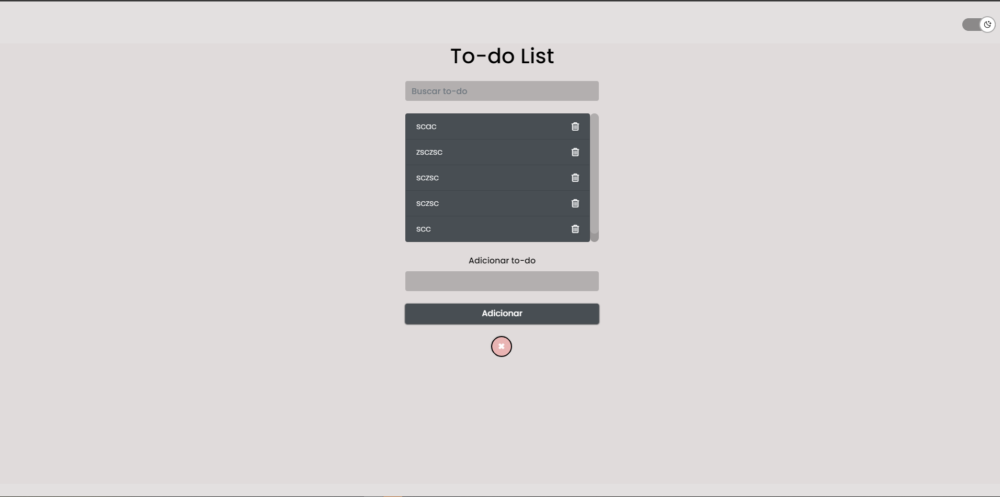
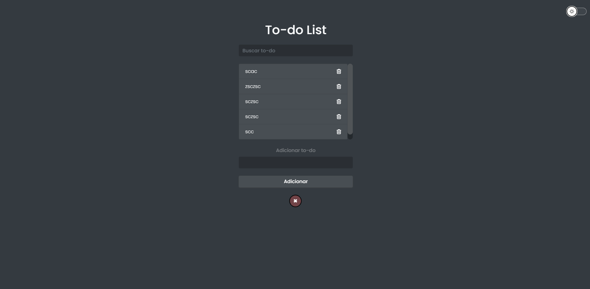

<h1 align="center"> To-do List </h1>

  Lista de terefas com JavaScript

  <a href="#-tecnologias">Tecnologias</a>&nbsp;&nbsp;&nbsp;|&nbsp;&nbsp;&nbsp;
  <a href="#-projeto">Projeto</a>&nbsp;&nbsp;&nbsp;|&nbsp;&nbsp;&nbsp;
  <a href="#-Acesse online">Acesse</a>&nbsp;&nbsp;&nbsp;|&nbsp;&nbsp;&nbsp;

 

  
  

## 🚀 Tecnologias

- HTML e SCSS
- JavaScript

## 💻 Projeto

Este projeto foi desenvolvido com as seguintes tecnologias:

- [x] Adicionar itens
- [x] Remover itens
- [x] Editar
- [x] Pesquisar/filtrar itens
- [x] Modo escuro e claro

## Acesse online

- [Acesse o projeto finalizado, ONLINE na Netlify](https://to-do-llist.netlify.app/)

